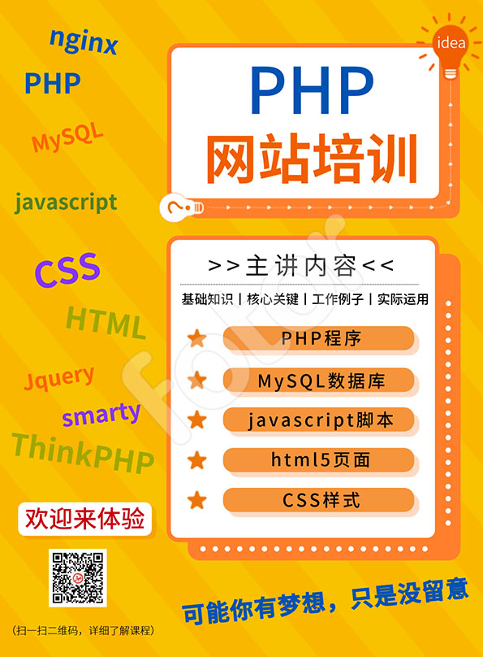

## 深圳坂田 PHP 培训
互联网大潮，人人都是创造者，每个人都可以成为开发者，人人都有梦想，说不定就可以实现。
我们是领路人，提供适合新人的环境，协助你看清方向。用实际工作中的例子，抽取核心关键功能，整理成为教学内容。

每件事情都有丰富的内容和延展，但通常只有关键的几个点，其它的是补助的枝叶。
参加培训，花了钱，节省了时间，减少了弯路，增加了信心，避免半途而废。

互联网知识太多，无处不在的陷阱，着实考验投入者的毅力，虽然门坎不高，但一个个坑，足以把自己消磨在漫足目标之中。

能够持久地做一件事情，支撑和动力来之内心的兴趣爱好，问问自己，曾经也喜欢钻研吗？曾为自己亲力亲为的作品感到自豪吗？

如果仍然存遗那份热情，欢迎你拥抱互联网大家庭。

全世界的网站有80%使用php，互联网应用还在快速扩展当中，就连以前的各种企业管理应用、销售管理、库存管理、人事管理、学校管理，手机应用，都逐渐转成了互联网程序，因为网站程序一次编写，一次部署，全世界的人就都可以用。

希望我们能助你一臂之力，达成你的愿望。附it薪资：

高等薪资2万～5万每月
中等薪资1万~2万每月
普通薪资5千~1万每月

it开发可以累积技术和经验，形成价值叠加，工作不受地理空间限制，灵活多样。需求宽广，扩充无可限量。

我们目前提供的培训内容：
php后端程序
mysql数据库
apache、nginx服务器
html前端
css样式
javascript 前端脚本

各类前端、后端框架，插件、工具等，结合工作实例，目的是让工作中的实际例子，让你感受开发的魅力，后续将提供显示作品的平台。

## 现在连小学课程都学编程了，我们有什么不可以？

